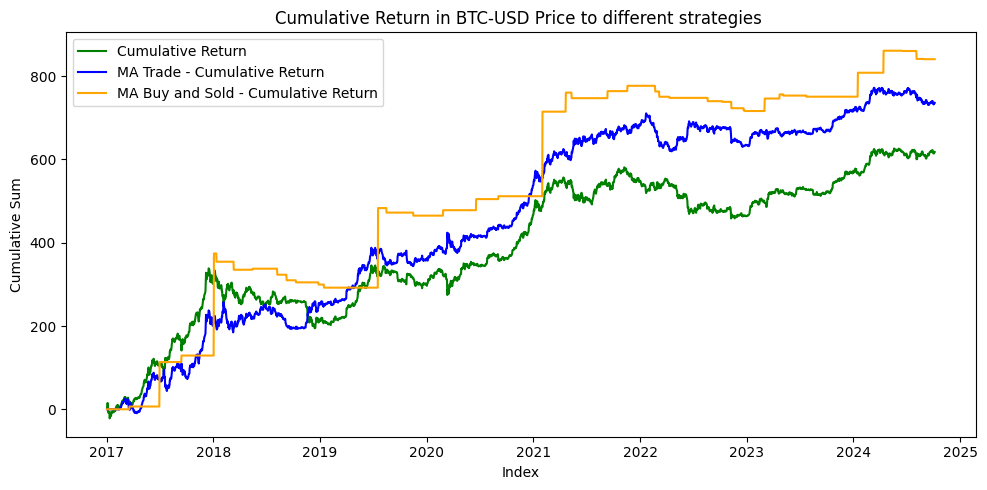

# 📊 **Backtest of Bitcoin Return Using Moving Averages (7 and 40 Days)**

## 🗂️ **Dataset Overview**

The dataset used for this analysis contains **historical stock price data for Bitcoin (BTC-USD)**. Check here: [Dataset in Kaggle](https://www.kaggle.com/datasets/gallo33henrique/bitcoin-btc-usd-stock-dataset/data)

It includes essential financial metrics such as:

- **Date**: Day of the recorded transaction.
- **Open**: Opening price of Bitcoin at the start of the session.
- **High**: Highest price reached during the session.
- **Low**: Lowest price recorded during the session.
- **Close**: Price at the end of the session.
- **Adj Close**: Adjusted closing price, reflecting real market changes like dividends and splits.
- **Volume**: Total Bitcoin trading volume for the session.

This dataset spans multiple years, providing the foundation for **backtesting trading strategies**.

---

## 🔍 **Analysis Steps**

### **Step 1: Importing Libraries and Loading Data**
The analysis begins by importing necessary libraries like `numpy`, `pandas`, and `matplotlib`. The dataset is loaded from a CSV file and displayed to ensure correct loading.

---

### **Step 2: Data Preprocessing**
To ensure the data is ready for analysis:
1. **Date Conversion:** The `Date` column is converted to **datetime format** for easy time-based operations.
2. **Percent Change Calculation:** A new column `Auto_pct` is added to reflect the **daily percentage change** in the adjusted close price.

---

### **Step 3: Data Analytics**
The follow analysis were made to price, percentage and volume variables.

1. **Statistical describe**;
2. **Line plot of High and Low Price (USD) over time**;
3. **Bar plot of Daily Percentage Change over time**;
4. **Blox plot of Daily Percentage Change**;
5. **Line plot of Cumulative Daily Percentage Change in BTC-USD Price over time**;
6. **Bar plot of Volume over time**;
7. **Blox plot of Volume Trade**.

---

### **Step 4: Moving Averages**
To identify trends, **7-day and 40-day moving averages** are calculated. 

Moving averages help smooth out price fluctuations and reveal trends over time.

The **7-day** and **40-day moving averages** are visualized alongside the original adjusted close prices to observe market trends visually.

---

### **Step 6: Backtesting Strategy**

The backtest is designed to calculate **returns based on position and buy/sell strategy** generated by the moving averages:
- **Position Strategy**
  - **Buy Position:** When the 7-day MA is above the 40-day MA.
  - **Sell Position:** When the 7-day MA is below the 40-day MA.
- **Buy/Sell Strategy**
  - **Buy Signal:** When the 7-day MA crosses above the 40-day MA.
  - **Sell Signal:** When the 7-day MA crosses below the 40-day MA.

---

### **Step 7: Return on Investment (ROI)**
The **returns are calculated** based on the adjusted close prices.

- BTC percent return over the days = **617,9099 %**

- BTC percent return with **Position Strategy** = **735,9885 %**

- BTC percent return with **Buy/Sell Strategy** = **840,8983 %**

---

## 📈 **Results and Discussion**

### **Visualizing Strategy Performance**
The **cumulative return** is plotted to evaluate how the moving average strategy performed over the specified time period.

---

### **Discussion of Results**
The moving average strategy provides **insightful buy/sell signals** based on trend crossovers:
- **Positive Cumulative Return** indicates the effectiveness of using **moving averages** to capture profitable trends.
- **Market Volatility** is noticeable, with some **false signals** generated due to short-term fluctuations.
- The strategy performs well during **trending markets**, but may struggle in **sideways or volatile markets** where frequent crossovers occur.

---

### **Conclusion**
This backtest demonstrates the **power of moving averages** in financial trading strategies. While the **7-day and 40-day moving averages** capture market trends effectively, further tuning or adding **additional indicators** may improve prediction accuracy and reduce false signals. The results suggest that **backtesting is crucial** in evaluating the viability of strategies before applying them to real-world trading scenarios.
